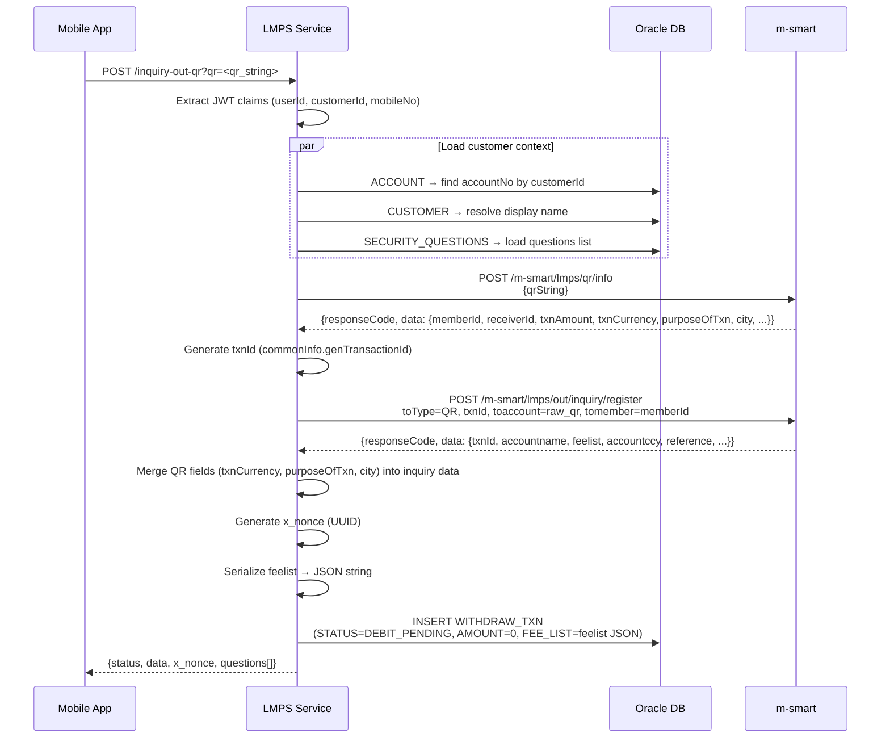

# Inquiry Out QR — Business Flow

**Endpoint:** `POST /inquiry-out-qr`  
**Ref:** `/docs/api/Controller.md`

---

## Processing Flow

---

## Happy Path

1. **Receive & validate request**
   - Required headers: `Authorization: Bearer <JWT>`, `Device-ID`
   - Required query parameter: `qr` (raw QR code string)
   - No request body

2. **Extract identity from JWT**
   - Decoded by `JwtAuthFilter` (RS256)
   - Resolve `userId`, `customerId`, `mobileNo` from token claims

3. **Load customer context from DB** *(3 queries)*
   - `ACCOUNT`: find active LAK account by `customerId` → `accountNo`
   - `CUSTOMER`: resolve display name — `NAME` if set, else `FIRST_NAME_EN + LAST_NAME_EN`, fallback to `userId`
   - `CUSTOMER_SECURITY_QUESTIONS` JOIN `SECURITY_QUESTIONS` → list of `{ id, description }`
   - No account found → return error response
   - No security questions found → return error response

4. **Call m-smart QR info**
   - `POST /m-smart/lmps/qr/info` with `"securityContext.channel": "MOBILE"`
   - Payload: `qrString` = raw QR string
   - Response: parsed QR fields — `memberId` (→ `tomember`), `receiverId`, `txnAmount`, `txnCurrency`, `purposeOfTxn`, `city`, etc.
   - On timeout (>10 s) or non-`0000` response → return error

5. **Generate txnId and call m-smart inquiry-out**
   - `txnId` is generated locally by this service via `commonInfo.genTransactionId("")` and included in the request to m-smart
   - `POST /m-smart/lmps/out/inquiry/register` with `"toType": "QR"`, `"securityContext.channel": "MOBILE"`
   - Payload: generated `txnId`, `toaccount` = raw QR string (not resolved account), `tomember` = `memberId` from step 4, sender `accountNo`, `customerId` (fromCif), `userId` (fromuser)
   - Response confirms same `txnId` and returns: `accountname` (CR name), `feelist`, `accountccy`, `reference`, etc.
   - On timeout (>10 s) or non-`0000` response → return error

6. **Merge QR-specific fields into inquiry data**
   - Overwrite `txnCurrency`, `purposeOfTxn`, `city` in the inquiry `data` object with values from QR info response (step 4)

7. **Save inquiry record to `WITHDRAW_TXN`**
   - Generate `x_nonce` (UUID) — returned to client for subsequent transfer call
   - Insert one row:
     - `PAYMENT_CHANNEL_ID = 25` (Lao QR channel — hardcoded)
     - `STATUS = 'DEBIT_PENDING'`, `AMOUNT = 0`
     - `TRANSACTION_ID` = `txnId`
     - `NONCE` = `x_nonce`
     - `PROVIDER_CODE` = `'LMPS'`
     - `DR_ACCOUNT_NO` = sender account number; `DR_CIF` = `customerId`; `DR_ACCOUNT_NAME` = customer display name
     - `CR_ACCOUNT_NO` = `accountname` from m-smart inquiry response (QR flow: name used as identifier, not an account number)
     - `CR_ACCOUNT_NAME` = `accountname` from m-smart inquiry response
     - `CURRENCY_CODE` = `accountccy` from inquiry response, default `'LAK'`
     - `REMARK` = `'QR'`
     - `FEE_LIST` = `feelist` object from m-smart response serialized to JSON string (snapshot used for fee calculation at transfer time)
   - If save fails → request fails; no `x_nonce` is issued to the client

8. **Build final response**
   - Base: m-smart inquiry `data` object (including merged QR fields)
   - Set `x_nonce` = UUID from step 7 (must match `WITHDRAW_TXN.NONCE`)
   - Inject `questions[]` (from step 3) into the root response body
   - Shape: `{ status, data, x_nonce, questions[] }`

9. **Return response to mobile app**

---

## Error Paths

| Condition | Behavior |
|---|---|
| Missing / invalid JWT | 401 — handled by `JwtAuthFilter` |
| Missing `qr` query param | 400 — return validation error |
| No account found for customer in DB | 400 — return error |
| No security questions found for customer | 400 — return error |
| m-smart QR info timeout | 504 — return error |
| m-smart QR info returns non-`0000` response | Forward m-smart error code/message |
| m-smart inquiry-out timeout | 504 — return error |
| m-smart inquiry-out returns non-`0000` response | Forward m-smart error code/message |
| `WITHDRAW_TXN` save fails | 500 — return error; no `x_nonce` issued |