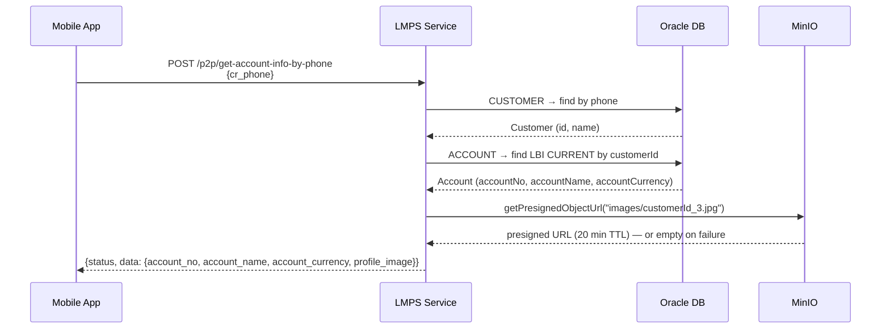

# P2P Get Account Info by Phone — Business Flow

**Endpoint:** `POST /p2p/get-account-info-by-phone`  
**Ref:** `/docs/api/p2pController.md`

---

## Processing Flow

---

## Happy Path

1. **Receive request**
   - Required headers: `Authorization: Bearer <JWT>`, `Content-Type: application/json`
   - Required body field: `cr_phone`

2. **Look up customer by phone**
   - Query `CUSTOMER` table: `findByPhone(crPhone)`
   - Not found → throw `ResourceNotFoundException("AccountInfoNotFound")`

3. **Look up LBI CURRENT account**
   - Query `ACCOUNT` table: `WHERE customerId = customer.id AND accountCurrency = 'LBI' AND accountType = 'CURRENT'`
   - Not found → throw `ResourceNotFoundException("AccountInfoNotFound")`

4. **Fetch profile image from MinIO**
   - Object path: `images/{customerId}_3.jpg`
   - Generates a presigned GET URL with a 20-minute TTL
   - On any exception (object missing, MinIO unreachable): logs a warning and returns `""` — does **not** fail the request

5. **Build and return response**
   - `status = "success"`
   - `data.account_no` = `account.accountNo`
   - `data.account_name` = `account.accountName`
   - `data.account_currency` = `account.accountCurrency`
   - `data.profile_image` = presigned URL or `""` if unavailable

---

## Error Paths

| Condition | Behavior |
|---|---|
| Missing / invalid JWT | 401 — handled by `JwtAuthFilter` |
| `cr_phone` not found in `CUSTOMER` | `ResourceNotFoundException` → error response |
| No LBI CURRENT account for customer | `ResourceNotFoundException` → error response |
| MinIO presign fails | Silent — `profile_image` returned as `""` |
