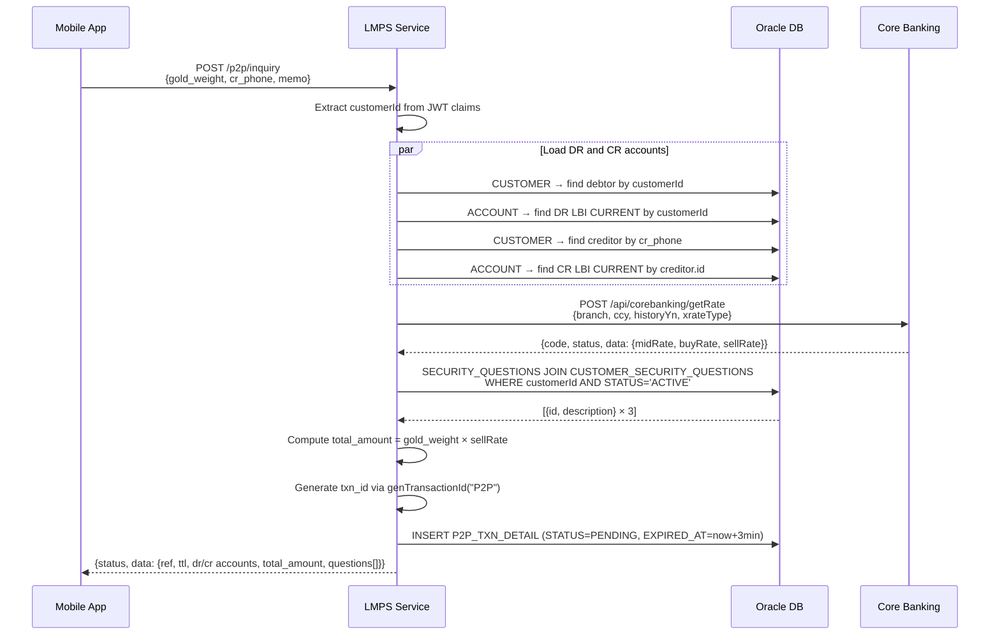

# P2P Inquiry — Business Flow

**Endpoint:** `POST /p2p/inquiry`  
**Ref:** `/docs/api/p2pController.md`

---

## Processing Flow

---

## Happy Path

1. **Receive request**
   - Required headers: `Authorization: Bearer <JWT>`, `Content-Type: application/json`
   - Required body fields: `gold_weight`, `cr_phone`; `memo` is optional

2. **Extract identity from JWT**
   - Decoded by `JwtAuthFilter` (RS256)
   - `customerId` is read from token claim `user-id`

3. **Load debtor (DR) account**
   - `CUSTOMER`: `findById(customerId)` → not found → 404
   - `ACCOUNT`: `findLbiCurrentByCustomerId(customerId)` → filter `ACCOUNT_CURRENCY='LBI'`, `ACCOUNT_TYPE='CURRENT'` → not found → 404

4. **Load creditor (CR) account**
   - `CUSTOMER`: `findByPhone(crPhone)` → not found → 404
   - `ACCOUNT`: `findLbiCurrentByCustomerId(creditor.id)` → same filter → not found → 404

5. **Fetch LBI gold rate from CBS**
   - `POST /api/corebanking/getRate` via `ApiCoreBanking.getRate()` (`RestClient`, connect 5 s / read 10 s timeout)
   - Fixed body: `{branch:"100", ccy:"LBI", historyYn:false, xrateType:"CSG"}`
   - `total_amount = gold_weight × data.sellRate`
   - Error or timeout → 500

6. **Load security questions** *(1 JOIN query)*
   - `SECURITY_QUESTIONS JOIN CUSTOMER_SECURITY_QUESTIONS WHERE CUSTOMER_ID=:customerId AND STATUS='ACTIVE' AND DELETE_AT IS NULL`
   - Returns 3 rows `{id, description}`
   - Error → 500

7. **Save inquiry to DB and return response**
   - Generate `ref = commonInfo.genTransactionId("P2P")` — format `P2Pyydddsssssmmmrrr`
   - INSERT `P2P_TXN_DETAIL` with `STATUS=PENDING`, `EXPIRED_AT=now+3min`
   - `ttl` = `180` s — client should not submit verify after this
   - DR and CR account fields from steps 3–4
   - `total_amount` = gold_weight × sellRate
   - `questions[]` = 3 entries from step 6

---

## Key Constants

| Name | Value | Source |
|---|---|---|
| CBS endpoint | `POST /api/corebanking/getRate` | `ApiCoreBanking.getRate()` |
| CBS timeout | connect 5 s / read 10 s | `RestClient` bean config |
| Response `ttl` | 180 s | `P2PServiceImpl` |
| Account filter | `ACCOUNT_CURRENCY='LBI'`, `ACCOUNT_TYPE='CURRENT'` | `AccountRepository` |
| `ref` | `P2Pyydddsssssmmmrrr` via `genTransactionId("P2P")` | `P2PServiceImpl` |

---

## Error Paths

| Condition | Behavior |
|---|---|
| Missing / invalid JWT | 401 — handled by `JwtAuthFilter` |
| `customerId` claim missing | 401 |
| Debtor customer not found | 404 `AccountInfoNotFound` |
| Debtor LBI CURRENT account not found | 404 `AccountInfoNotFound` |
| Creditor customer not found (by phone) | 404 `AccountInfoNotFound` |
| Creditor LBI CURRENT account not found | 404 `AccountInfoNotFound` |
| CBS `/gold-rate` error / timeout | 500 |
| Security questions query error | 500 |
