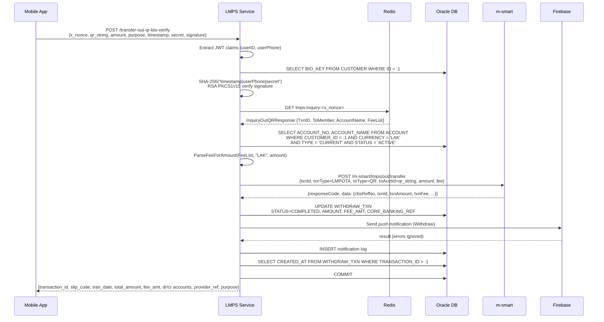

# Transfer Out QR Biometric Verify — Business Flow

**Endpoint:** `POST /transfer-out-qr-bio-verify`  
**Ref:** `/docs/api/Controller.md`

Prerequisites: a successful `/inquiry-out-qr` call that stored an `InquiryOutQRResponse` in Redis under key `lmps:inquiry:<x_nonce>` (10-min TTL).

---

## Processing Flow

---

## Happy Path

1. **Receive & validate request**
   - Required headers: `Authorization: Bearer <JWT>`, `Device-ID`
   - Required body fields: `x_nonce`, `qr_string`, `amount`, `timestamp`, `secret`, `signature`
   - Optional body field: `purpose`
   - Decode failure → `400`

2. **Open DB transaction**
   - `context.WithTimeout` wraps the entire flow
   - `BeginTx` failure → `500`

3. **Extract identity from JWT**
   - `userID` resolved from Echo context → `401` if missing
   - `userPhone` resolved from Echo context → `401` if missing

4. **Verify biometric signature** *(helpers: `payment/lmps_helpers.go:57`)*
   - Compute SHA-256 digest of `"timestamp|userPhone|secret"`
   - `SELECT BIO_KEY FROM CUSTOMER WHERE ID = :1` — fetches user's RSA public key PEM
   - Decode PEM block, parse PKIX DER bytes into `*rsa.PublicKey`
   - `rsa.VerifyPKCS1v15` verifies the base64-decoded `signature` against the digest
   - Signature mismatch → `tx.Rollback()` → `401`
   - Key parse / crypto error → `tx.Rollback()` → `500`

5. **Fetch inquiry data from Redis** *(helpers: `payment/lmps_helpers.go:160`)*
   - `GET lmps:inquiry:<x_nonce>` — retrieves the `InquiryOutQRResponse` cached by the prior `/inquiry-out-qr` call (10-min TTL)
   - Cache miss or expiry → `tx.Rollback()` → `400`
   - JSON-unmarshal; key fields carried forward: `TxnID`, `ToMember`, `AccountName`, `FeeList`

6. **Load sender account** *(helpers: `payment/lmps_helpers.go:191`)*
   - `SELECT ACCOUNT_NO, ACCOUNT_NAME FROM ACCOUNT WHERE CUSTOMER_ID = :1 AND ACCOUNT_CURRENCY = 'LAK' AND ACCOUNT_TYPE = 'CURRENT' AND STATUS = 'ACTIVE'`
   - Query failure → `tx.Rollback()` → `500`

7. **Calculate fee**
   - `lmps.ParseFeeForAmount(inquiryResp.Data.FeeList, "LAK", amount)`
   - Lookup failure → logs warning, defaults `fee = 0`; does not abort

8. **Execute m-smart transfer-out** *(client: `lmps/client.go:436`)*
   - `POST /m-smart/lmps/out/transfer` — 180s timeout
   - Key payload fields:

     | Field | Value |
     |-------|-------|
     | `txnId` | `TxnID` from Redis |
     | `txnType` | `"LMPOTA"` |
     | `toType` | `"QR"` |
     | `toAcctId` | raw `qr_string` from request |
     | `txnCcy` | `"LAK"` |
     | `txnAmount` | `amount` from request |
     | `txnFee` | fee from step 7 |

   - HTTP transport error → `tx.Rollback()` → `500 ER_LAP_NET_FAILED`
   - Non-200 HTTP status → `tx.Rollback()` → `500 ER_LAP_NET_FAILED`
   - Response code mapping:

     | Code | Error |
     |------|-------|
     | `3013` | `ErrTransactionNotFound` |
     | `API0014` | `ErrInvalidQRCode` |
     | other | `ErrLMPSAPIError` |

9. **Update `WITHDRAW_TXN`** *(helpers: `payment/lmps_helpers.go:211`)*
   - `UPDATE WITHDRAW_TXN SET STATUS='COMPLETED', AMOUNT=:2, FEE_AMT=:3, CORE_BANKING_REF=:4 WHERE TRANSACTION_ID=:5`
   - Query failure → `tx.Rollback()` → `500`

10. **Send push notification** *(noti: `payment/noti.go:13`)*
    - Fetch FCM token for user from DB
    - Send Firebase push notification (`"Withdraw"` type)
    - FCM errors are logged but do not abort the transaction
    - Insert notification log record (`SENT` or `FAILED`)

11. **Fetch transaction date** *(helpers: `payment/lmps_helpers.go:246`)*
    - `SELECT CREATED_AT FROM WITHDRAW_TXN WHERE TRANSACTION_ID = :1`
    - Query failure → `tx.Rollback()` → `500`

12. **Commit**
    - `tx.Commit()` failure → `500`

13. **Build and return response** *(helpers: `payment/lmps_helpers.go:264`)*
    - `BuildWithdrawResponse` assembles `WithdrawNotifyBody` from the transfer result and transaction date
    - Returns `200 OK`

    | Field | Source |
    |-------|--------|
    | `transaction_id` | `result.txnId` |
    | `slip_code` | `result.txnId` |
    | `tran_date` | `WITHDRAW_TXN.CREATED_AT` |
    | `total_amount` | `result.txnAmount` |
    | `currency_code` | `result.txnCcy` |
    | `fee_amt` | `result.txnFee` |
    | `dr_account_no` | sender account from step 6 |
    | `dr_account_name` | sender account name from step 6 |
    | `cr_account_no` | `result.toAcctId` (raw QR string) |
    | `cr_account_name` | `AccountName` from Redis |
    | `provider_ref` | `result.cbsRefNo` |
    | `purpose` | `purpose` from request |

---

## Error Paths

| Condition | Behavior |
|-----------|----------|
| Missing / invalid JWT | `401` — handled by `protectAccessToken` middleware |
| JSON decode failure | `400` |
| DB transaction open failure | `500` |
| `userID` missing from context | `401` |
| `userPhone` missing from context | `401` |
| `BIO_KEY` not found / key parse error | `tx.Rollback()` → `500` |
| RSA signature mismatch | `tx.Rollback()` → `401` |
| Redis miss or TTL expired | `tx.Rollback()` → `400` |
| Account query failure | `tx.Rollback()` → `500` |
| m-smart transport / non-200 error | `tx.Rollback()` → `500 ER_LAP_NET_FAILED` |
| m-smart returns `3013` | `tx.Rollback()` → `500` (`ErrTransactionNotFound`) |
| m-smart returns `API0014` | `tx.Rollback()` → `500` (`ErrInvalidQRCode`) |
| `WITHDRAW_TXN` update failure | `tx.Rollback()` → `500` |
| `CREATED_AT` query failure | `tx.Rollback()` → `500` |
| `tx.Commit()` failure | `500` |
| FCM send failure | logged only — does not abort |

---

## Known Bugs

| # | Location | Issue | Fix |
|---|----------|-------|-----|
| 1 | `payment/lmps_qr_out.go:752` | `err.Error() == "TRANSACTION_NOT_FOUND"` never matches — wrapped error is `"TRANSACTION_NOT_FOUND: <msg>"` | Replace with `errors.Is(err, lmps.ErrTransactionNotFound)` |
| 2 | `payment/lmps_qr_out.go:569` | Same broken string check in quotation-verify | Same fix |
| 3 | `payment/lmps_qr_out.go:652,662` | After `ok == false`, error log re-asserts `.(string)` without `,ok` — potential panic | Use safe string assertion or omit the re-assertion |
| 4 | `payment/lmps_qr_out.go:713` | Fee lookup with `"LAK"` may not match `FeeList` keys — fee always defaults to `0` | Verify key format returned by LMPS in `FeeList` |