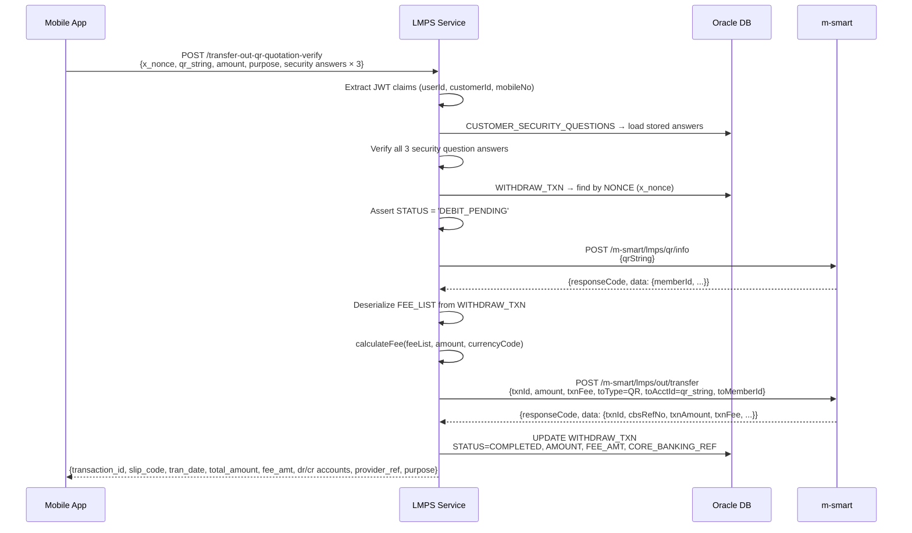

# Transfer Out QR — Business Flow

**Endpoint:** `POST /transfer-out-qr-quotation-verify`  
**Ref:** `/docs/api/Controller.md`

Prerequisites: a successful `/inquiry-out-qr` call that produced a valid `x_nonce` and a `WITHDRAW_TXN` row in `DEBIT_PENDING` status.

---

## Processing Flow

---

## Happy Path

1. **Receive & validate request**
   - Required headers: `Authorization: Bearer <JWT>`, `Device-ID`
   - Required body fields: `x_nonce`, `qr_string`, `amount`, `first_question_id`, `first_answer`, `second_question_id`, `second_answer`, `third_question_id`, `third_answer`
   - Optional body field: `purpose`

2. **Extract identity from JWT**
   - Decoded by `JwtAuthFilter` (RS256)
   - Resolve `userId`, `customerId`, `mobileNo` from token claims

3. **Verify security question answers**
   - Load all stored answers for `customerId` from `CUSTOMER_SECURITY_QUESTIONS`
   - Verify each of the 3 submitted answers using case-insensitive comparison
   - Any wrong or unknown question ID → throw `BusinessException("4002")` immediately

4. **Load pending transaction by nonce**
   - `SELECT * FROM WITHDRAW_TXN WHERE NONCE = x_nonce`
   - Not found → `ResourceNotFoundException` (invalid or expired nonce)
   - Found but `STATUS ≠ 'DEBIT_PENDING'` → `BusinessException("4001")` (already processed or cancelled)

5. **Call m-smart QR info to resolve memberId**
   - `POST /m-smart/lmps/qr/info` with `"securityContext.channel": "MOBILE"`
   - Payload: `qrString` = `qr_string` from request
   - Extracts `memberId` for the transfer-out call
   - On timeout (>10 s) or non-`0000` response → return error

6. **Calculate fee from stored fee list**
   - Deserialize `WITHDRAW_TXN.FEE_LIST` (JSON) into `FeeList` object
   - Select tier list by `WITHDRAW_TXN.CURRENCY_CODE` (`LAK` → `LAK` tiers, `THB` → `THB` tiers, `USD` → `USD` tiers)
   - Walk tiers in order; apply the last tier where `amount >= tier.from` (highest applicable tier wins)
   - Fee is `BigDecimal.ZERO` if no tiers available for the currency

7. **Execute m-smart transfer-out**
   - `POST /m-smart/lmps/out/transfer` with `"securityContext.channel": "MSMART"`
   - Key payload fields:
     - `txnId` = `WITHDRAW_TXN.TRANSACTION_ID`
     - `txnType` = `"LMPOTA"`
     - `txnAmount` = `request.amount`
     - `txnFee` = calculated fee from step 6
     - `txnCcy` = `WITHDRAW_TXN.CURRENCY_CODE`
     - `toType` = `"QR"`
     - `toAcctId` = raw `qr_string` from request
     - `toMemberId` = `memberId` from step 5
     - `fromAcctId`, `fromCif`, `fromCustName`, `toCustName` = values from `WITHDRAW_TXN`
   - On timeout (>10 s) or non-`0000` response → return error

8. **Update `WITHDRAW_TXN`** *(within `@Transactional`)*
   - `STATUS` = `'COMPLETED'`
   - `AMOUNT` = `result.txnAmount` (fallback: `request.amount`)
   - `FEE_AMT` = `result.txnFee` (fallback: calculated fee from step 6)
   - `FEE_PROVIDER_AMT` = same as `FEE_AMT`
   - `CORE_BANKING_REF` = `result.cbsRefNo`
   - `VERSION` incremented by 1

9. **Build and return response**
   - Shape: flat object (no wrapping `data` key)

   | Field | Source |
   |-------|--------|
   | `transaction_id` | `result.txnId` |
   | `slip_code` | `result.txnId` |
   | `tran_date` | `LocalDateTime.now()` formatted `yyyy-MM-dd HH:mm:ss` |
   | `total_amount` | `result.txnAmount` |
   | `currency_code` | `result.txnCcy` |
   | `fee_amt` | `result.txnFee` |
   | `dr_account_no` | `result.fromAcctId` |
   | `dr_account_name` | `result.fromCustName` |
   | `cr_account_no` | `result.toAcctId` (raw QR string) |
   | `cr_account_name` | `result.toCustName` |
   | `provider_ref` | `result.cbsRefNo` |
   | `purpose` | `result.purpose` |

---

## Fee Calculation Logic

Fee tiers are stored as a JSON snapshot in `WITHDRAW_TXN.FEE_LIST` at inquiry time. At transfer time, the fee is computed locally without re-fetching from m-smart.

**Algorithm:** Walk tiers from lowest to highest `from` value; the last tier where `amount >= from` applies.

**Example** (LAK, amount = 3,500,000 LAK):

| Tier `from` | `feeamount` | Applies? |
|-------------|-------------|---------|
| 0 | 1,000 | yes |
| 2,000,001 | 1,500 | yes |
| 3,000,001 | 2,500 | yes |
| 4,000,001 | 3,000 | no — 3,500,000 < 4,000,001 |

→ Fee = **2,500 LAK**

---

## Error Paths

| Condition | Behavior |
|---|---|
| Missing / invalid JWT | 401 — handled by `JwtAuthFilter` |
| Missing required fields | 400 — return validation error |
| Security question answer wrong or question ID not found | `BusinessException("4002")` |
| `x_nonce` not found in `WITHDRAW_TXN` | `ResourceNotFoundException` |
| `WITHDRAW_TXN.STATUS ≠ 'DEBIT_PENDING'` | `BusinessException("4001")` |
| m-smart QR info timeout | 504 — return error |
| m-smart QR info returns non-`0000` response | Forward m-smart error code/message |
| m-smart transfer-out timeout | 504 — return error |
| m-smart transfer-out returns non-`0000` response | Forward m-smart error code/message |
| `WITHDRAW_TXN` update fails | 500 — transaction rolled back; transfer may have already completed at m-smart |